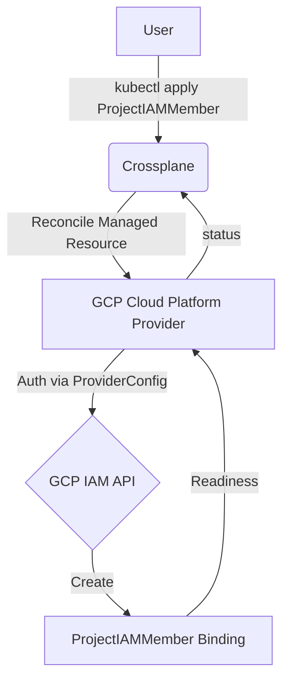
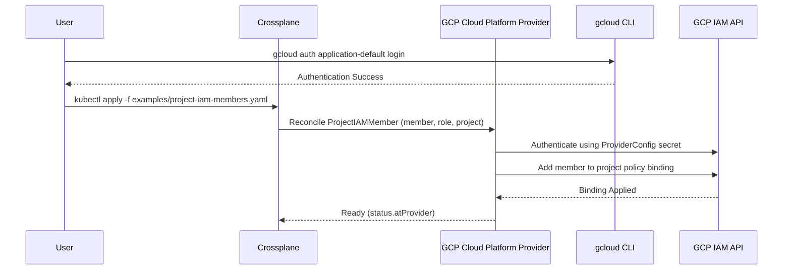

# crossplane-gcp-iam-rbac-google-groups

This Crossplane project manages GCP IAM RBAC by assigning roles to free consumer Google Groups. No Google Cloud Organization required!

Bindings are created with the Upbound GCP Cloud Platform provider (`provider-gcp-cloudplatform`), which exposes `ProjectIAMMember` managed resources (`cloudplatform.gcp.upbound.io/v1beta1`).

## Architecture

### Flowchart


### Sequence Diagram


## Binding Specifications
- **Members**: Free consumer Google Groups (`group:<email>`), e.g. `my-free-devops-team@googlegroups.com`. No Google Cloud Organization or Workspace required.
- **Roles**: Standard GCP IAM roles such as `roles/compute.admin`, `roles/storage.objectUser`, etc.
- **Naming**: Each binding is a `ProjectIAMMember` managed resource named `<group-prefix>-<role>` (e.g. `my-free-devops-team-compute-admin`), mirroring the Terraform `for_each` keys.
- **Dynamic Bindings**: Because the group -> roles map is dynamic, a Crossplane Composition (PatchAndTransform mode) cannot create a variable number of resources. This project is therefore consumed **directly via `ProjectIAMMember` managed resources** (see `examples/`), not via a Composition/claim.

## GCP Free Tier Limits (Always Free)
- **Google Groups**: Free consumer Google Groups (`@googlegroups.com`) are free and have no project quota impact.
- **IAM bindings**: IAM policy management is free; there is no cost for assigning roles.
- **Compute engine**: Any roles applied are free; resource usage is billed separately per service.

## Prerequisites
1.  **A Kubernetes cluster** with **Crossplane** installed.
    ```bash
    # Add the Crossplane Helm repository
    helm repo add crossplane-stable https://charts.crossplane.io/stable
    helm repo update

    # Install Crossplane
    helm install crossplane crossplane-stable/crossplane --namespace crossplane-system --create-namespace
    ```
2.  **kubectl** [configured](https://kubernetes.io/docs/tasks/tools/) to talk to your cluster.
3.  **Google Cloud SDK**: [Installed and initialized](https://cloud.google.com/sdk/docs/install).
4.  **A GCP service account** with `roles/resourcemanager.projectIamAdmin` (or `roles/owner`) on the target project and a JSON key.

## Setup & Deployment

1.  **Authenticate Locally** (only needed to generate a service account key):
    ```bash
    gcloud auth application-default login
    gcloud config set project your-project-id
    ```

2.  **Create the GCP credentials secret** in the cluster:
    ```bash
    # Base64-encode your service account JSON key
    CREDS=$(base64 -w0 /path/to/service-account-key.json)

    # Create the secret consumed by the ProviderConfig
    kubectl create secret generic gcp-creds \
      --namespace crossplane-system \
      --from-literal=creds="$CREDS"
    ```
    > Alternatively, edit `provider/credentials-secret.yaml` with the base64-encoded key and run `kubectl apply -f provider/credentials-secret.yaml`.

3.  **Install the GCP Cloud Platform Provider**:
    ```bash
    kubectl apply -f provider/provider.yaml

    # Wait until the provider is healthy
    kubectl wait --for=condition=Healthy provider/upbound-provider-gcp-cloudplatform --timeout=300s
    ```

4.  **Configure the ProviderConfig**:
    Edit `provider/provider-config.yaml` and set your `projectID`, then apply:
    ```bash
    kubectl apply -f provider/provider-config.yaml
    ```

5.  **Apply the IAM bindings** (one `ProjectIAMMember` per group/role pair):
    Edit `examples/project-iam-members.yaml` and replace `PROJECT_ID`, then apply:
    ```bash
    kubectl apply -f examples/project-iam-members.yaml
    ```

6.  **Verify the bindings** become `Ready`:
    ```bash
    kubectl wait --for=condition=Ready \
      projectiammembers.cloudplatform.gcp.upbound.io --all --timeout=300s

    kubectl get projectiammembers.cloudplatform.gcp.upbound.io \
      -o custom-columns=NAME:.metadata.name,MEMBER:.spec.forProvider.member,ROLE:.spec.forProvider.role
    ```

## Direct Managed Resources

This project does not ship a Composition: the number of bindings is driven by a dynamic group -> roles map, which a `PatchAndTransform` Composition cannot express. Instead, apply `ProjectIAMMember` managed resources directly - one per binding, exactly mirroring the Terraform `for_each` over the flattened map:

```bash
kubectl apply -f examples/project-iam-members.yaml   # edit it first (PROJECT_ID)
```

Add or remove bindings by adding or removing documents in `examples/project-iam-members.yaml`, or by applying an additional file with the bindings for your group.

## Bindings (default example)

| Group | Roles |
|-------|-------|
| `my-free-devops-team@googlegroups.com` | `roles/compute.admin`, `roles/run.admin`, `roles/cloudbuild.admin`, `roles/storage.admin` |
| `my-free-dev-team@googlegroups.com` | `roles/compute.viewer`, `roles/run.developer`, `roles/cloudbuild.editor`, `roles/storage.objectUser` |

## Parameters

| Parameter | Description | Type | Default |
|-----------|-------------|------|---------|
| `project_id` | GCP project ID where bindings are applied | `string` | (required) |
| `region` | GCP region (Free Tier: us-west1, us-central1, us-east1) | `string` | `"us-central1"` |
| `team_permissions` | Map of group -> assigned roles | `map(list(string))` | DevOps + Dev groups above |

> Parameters are the inputs to the Terraform/CI/CD workflow; in the Crossplane manifests the project is set in `spec.forProvider.project` and the group/role are set per `ProjectIAMMember`.

## Outputs

| Output | Description |
|--------|-------------|
| *(none)* | This project intentionally produces no outputs. Readiness of each binding is exposed via its `Ready` condition. |

## Resources Created

- `Provider` – `upbound/provider-gcp-cloudplatform` Crossplane provider package
- `ProviderConfig` – `gcp-provider-config` (GCP credentials + project)
- `ProjectIAMMember` – `cloudplatform.gcp.upbound.io/v1beta1` managed resources, one per group/role binding

## CI/CD Setup (GitHub Actions)

> **Note:** Because this project uses direct managed resources (no Composition/claim), the CD workflows apply and destroy the resources in `examples/` instead of a claim.

### Prerequisites
1.  **Install Crossplane** on a cluster reachable from GitHub Actions.
2.  **Create a GCP service account** with `roles/resourcemanager.projectIamAdmin` and generate a JSON key:
    - GCP Console → IAM & Admin → Service Accounts → Create Service Account
    - Grant `Project IAM Admin` (or `roles/resourcemanager.projectIamAdmin`)
    - Keys → Add Key → Create New Key → JSON
    - Copy the entire JSON file contents

3.  **Add GitHub secrets**:

    | Secret Name | Value |
    |---|---|
    | `GCP_SA_KEY` | Full JSON key from step 2 |
    | `KUBECONFIG` | Base64-encoded kubeconfig of the Crossplane cluster (`kubectl config view --minify --raw \| base64 -w0`) |

4.  **Run the workflow**:
    - **Apply**: Go to Actions → **CD - GCP IAM RBAC (Apply)** → fill in all inputs
    - **Destroy**: Go to Actions → **CD - GCP IAM RBAC (Destroy)** → optionally remove the provider

## Destroy

To delete the bindings and all associated resources:

```bash
# Delete the managed resources -> removes the IAM bindings
kubectl delete -f examples/

# Optional: uninstall the provider and its credentials
kubectl delete -f provider/provider.yaml
kubectl delete -f provider/provider-config.yaml
kubectl delete secret gcp-creds --namespace crossplane-system
```
